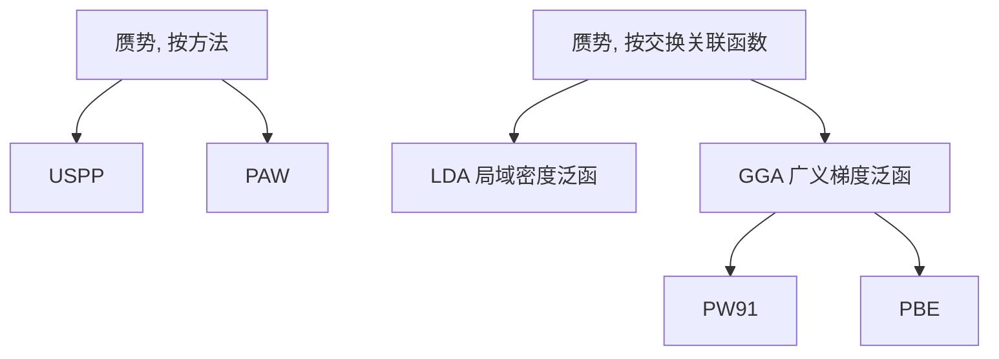

# VASP 的输入文件

VASP 运行至少包含四个输入文件：`INCAR`、`POSCAR`、`POTCATR`、`KPOINTS`。

## INCAR

INCAR 是 VASP 运行的**控制文件**，他告诉 VASP 要**做什么以及如何去做**。INCAR 文件中包含很多标签及其对应的值，通过修改他们来修改 VASP 运行的参数。

标签的含义可以查 [下一页](02.vasp-input-files-INCAR.md) 和 [VASP手册](https://www.vasp.at/wiki/index.php/Category: INCAR) 。

## POSCAR

POSCAR 是个**结构文件**，他告诉 VASP 要运行的是什么物质。该文件包含晶格几何形状和离子位置等。

这是一个 POSCAR 文件的示例：

```txt
O2 molecule           # 注释行
10                    # 比例，提供了通用缩放因子（晶格常数）
1.0 0.0 0.0           # 3-5行 格矢
0.0 1.0 0.0
0.0 0.0 1.0
O                     # 元素类别（与它们在POTCAR文件中的顺序一致）
2                     # 原子数量
Selective Dynamic     # 
Direct                # 坐标类别：分数/笛卡尔
0.5 0.5 0.5    F F F  # 每个原子的三个(X Y Z)坐标。
0.5 0.5 0.623  F F T
```

第 8 行：该模式允许为每个原子提供额外的标志，以指示在离子弛豫期间是否将允许更改此原子的相应坐标。如果仅缺陷周围的某些壳或表面附近的层应松弛，则此设置很有用。**这一行是可选的，如果省略了选择性动力学标签，则第八行将在笛卡尔和直角坐标之间进行切换，如下。**

```txt
O2 molecule           # 注释行
10                    # 比例，提供了通用缩放因子（晶格常数）
1.0 0.0 0.0           # 3-5行 格矢
0.0 1.0 0.0
0.0 0.0 1.0
O                     # 元素类别（与它们在POTCAR文件中的顺序一致）
2                     # 原子数量
Direct                # 坐标类别：分数/笛卡尔
0.5 0.5 0.5           # 每个原子的三个(X Y Z)坐标。
0.5 0.5 0.623  
```

第 9 行：（如果不启用选择性动力学，则为第 8 行）指定原子位置是在笛卡尔坐标系（cartesian coordinates）中还是在分数坐标（direct (fractional) coordinates）中提供。

分数坐标是把点阵矢量看成是单位矢量下确定原子位置; 笛卡尔坐标是绝对坐标，是直角坐标系与斜角坐标系的统称，考虑点阵常数的大小。

Basically, the fractional coordinates show the fraction of each unit cell vector that contributes to the position of that atom。根本上来说，分数坐标给出了每个原子在元胞的相对位置。

晶格参数：

$$
\begin{aligned}
  &A (A_x  A_y  A_z)\qquad    & 2.46\qquad     & 0.00\qquad     & 0.00   \\
  &B (B_x  B_y  B_z)\qquad    &-1.23\qquad     & 2.13\qquad     & 0.00   \\
  &C (C_x  C_y  C_z)    & 0.00\qquad     & 0.00\qquad     & 10.00  \\
\end{aligned}
$$

一个点的分数坐标   （a, b, c）=（0.667， 0.333， 0）

$$
\begin{aligned}
  &x = A_xa+B_xb+C_xc = &2.46*0.667&-&1.23*0.333&+&0*0&=1.23    \\
  &y = A_ya+B_yb+C_yc = &0*0.667&+&2.13*0.333&+&0*0&=0.71    \\
  &z = A_za+B_zb+C_zc = &0*0.667&+&0*0.333&+&10*0&=0
\end{aligned}
$$

这个点的笛卡尔坐标 （x, y, z）= (1.23，0.71， 0)

所以，笛卡尔坐标并不是原子在我们作为参考的直角坐标系中的绝对位置，而是在元胞基矢构成坐标系中，原子的绝对位置，而分数坐标，就是原子在元胞基矢构成坐标系中原子的相对位置。对于一个斜角坐标系，显然原子的相对位置比较好判断，所以，我们一般在 POSCAR 中用到的是其分数坐标，如果需要用到笛卡尔坐标，就用上面的公式转换。

抽象一些，用矩阵表示，对于以下两种坐标系：

$$
\begin{aligned}
& \text{system\_name}                          &\     & \text{system\_name}           \\
& \text{lattice\_constant\_1}                  &\     & \text{lattice\_constant\_2}   \\
&  \begin{matrix}

A_{x} & A_{x} & A_{x} \\

B_{x} & B_{y} & B_{y} \\

C_{x} & C_{z} & C_{z}

\end{matrix}          &\
&  \begin{matrix}

A_{x} & A_{x} & A_{x} \\

B_{x} & B_{y} & B_{y} \\

C_{x} & C_{z} & C_{z}

\end{matrix}\\
& \text{elements\_type}                         &\    & \text{elements\_type}         \\
& \text{atom\_number}                           &\    & \text{atom\_number}           \\
& \text{Direct}                                 &\    & \text{Cartesion}              \\
&   \begin{matrix}
   X_{11} & X_{12} & X_{13} \\
   X_{21} & X_{22} & X_{23} \\
   X_{31} & X_{32} & X_{33}
  \end{matrix}
  &
&   \begin{matrix}
   x_{11} & x_{12} & x_{13} \\
   x_{21} & x_{22} & x_{23} \\
   x_{31} & x_{32} & x_{33}
  \end{matrix} \\
\end{aligned}
$$

有

$$
\left[
 \begin{matrix}
  X_{11} & X_{12} & X_{13} \\
  X_{21} & X_{22} & X_{23} \\
  X_{31} & X_{32} & X_{33}
 \end{matrix}
\right]
*
\left[
 \begin{matrix}
  A_{x} & A_{x} & A_{x} \\
  B_{x} & B_{y} & B_{y} \\
  C_{x} & C_{z} & C_{z}
 \end{matrix}
\right]
*lattice\_content\_1 \\
=
\left[
 \begin{matrix}
  x_{11} & x_{12} & x_{13} \\
  x_{21} & x_{22} & x_{23} \\
  x_{31} & x_{32} & x_{33}
 \end{matrix}
\right]
*lattice\_content\_2
$$

vaspkit 411-412 可以转换。

> 参考：
>
> [vasp 的 POSCAR 文件中的 Direct 坐标和 Cartesion 坐标的关系 - 小木虫](http://muchong.com/html/201708/6640507.html)
>
> [POSCAR - VaspWiki](https://www.vasp.at/wiki/index.php/POSCAR)
>
> [POSCAR 关于分数坐标与笛卡尔坐标写法问题 - 郝玲娟 xueer 的新浪博客](http://blog.sina.com.cn/s/blog_17589e0920102xhee.html)
>
> [笛卡尔坐标系 - 维基百科](https://zh.wikipedia.org/wiki/%E7%AC%9B%E5%8D%A1%E5%B0%94%E5%9D%90%E6%A0%87%E7%B3%BB)

::: tip
8 行 9 行均只识别第一个字母。即 VASP 识别的唯一关键字符是 `C`or`c` for `cartesian mode`，`D`or`d`for `direct mode`，`S`or`s`for `Select`。
:::

## POTCAR

赝势文件。POTCAR 文件包含计算中使用的每个原子种类的赝势。如果物种数量大于一个，则**按照 POSCAR 中原子的顺序**合并每个物种的 POTCAR 文件。

其他见：<https://www.bigbrosci.com/2017/10/18/ex1_05_vasp_preparation_input_potcar/>

vasp 计算中用到的三种赝势：模守恒赝势，超软赝势，PAW 赝势(按产生顺序)。

> 按方法不同分为 USPP 和 PAW（两种方法都可以相当程度地减少过渡金属或第一行元素的每个原子 所必需的平面波数量）。
>
> 按交换关联函数不同分为 LDA 和 GGA（又分为 PW91 和 PBE）  //求解 K-S 方程时电子之间的交换关联泛函取局域密度泛函 LDA（Rc 处电子结构当成是密度相同的均匀电子气体来算） 或 广义梯度泛函 GGA（考虑了密度的梯度变化），但泛函的不同也会引起贋势的不同。



每种元素往往还会有多种赝势存在。这是因为根据 ENMAX 的大小还可以分为 Ga，Ga_s（soft），Ga_h，或者根据处理半芯态的不同还可以分为 Ga，Ga_sv（s 电子作为半芯态），Ga_pv 的不同。

> <https://blog.csdn.net/kyang_823/article/details/56277201>

## KPOINTS

K 点取样文件。KPOINTS 文件用于指定 Bloch 矢量（k 点），这些矢量将用于在计算中对布里渊区进行采样。

可以使用几种不同的方法在 KPOINTS 文件中指定 k 点：（1）作为自动生成的（移位的）常规点网格；（2）通过线段的起点和终点；或（ 3）作为点和权重的明确列表。

```txt
K-POINTS      #  第一行随便写都行，但不能没有
 0             # 零，格子自动生成
Gamma         #  gamma点centered 
1 1 1         #  1*1*1格子
0 0 0         #  S1 S2 S3， 一般保持 0 0 0 不变。
```

**详解:**

- 该 KPOINTS 文件里面，共有 5 行，#号以及后面的不用输入；
- 同 INCAR 的注释一样，不要在每一行后面使用 ! 来进行注释，要使用 # ，且最好不要写中文。
- 第一行：可以随便写内容，但不能没有;
- 第二行：数字 0，不是字母 O，0 在这里表示的是自动生成 K 点。你可能注意到了，0 前面有个空格，不过没关系，对计算不影响，可以删掉，也可以再加一个空格，后面的同样如此。 但是避免用 tab 输入，VASP 有时候不识别 tab 键输入的空白部分，导致计算出错；
- 第三行：VASP 只认第一个字母，大小写均可。在这里 Gamma 和 gamma，Gorge，gorge 效果是一样的，当然这一行也可以直接写字母 G 或者 g。
  - G 表示的是以 gamma 点为中心生成网格。
  - 另外一种是原始的 Monkhorst-Pack 网格，两者的区别是 M 或者 m 在 G 的基础上在三个方向上平移了 1/（2N）个单位。
  - G，也叫 gamma centered Monkhorst-Pack Grid；所以，gamma centered 只是 MP 网格的一种特殊情况。
- 第四行，在 xyz 三个方向上生成对应数目的 K 点，本例是 111;
  - 对于原子或者分子的计算，K 点取一个 gamma 点就够了（1 1 1），也就是这个 KPOINTS 文件可以用于绝大多数的原子或者分子计算，不用再修改；
  - 但如果你要用 ISMEAR = -5 来计算能量，那么就需要把 1 1 1 改成 2 2 2 或者 3 3 3。
- 第五行，一般都写成 0 0 0 ，不用动即可；
- 按照前面 INCAR 的方式保存文件，名字为 KPOINTS。

**KPOINTS 的建议:**

K 点在 VASP 计算中非常重要，大师兄给的一个建议是：

- 一直用 gamma centered，也就是第三行保持 G 不变。因为 M 平移之后，网格的对称性和晶胞的对称性会出现不匹配的情况，从而导致计算出错，尤其是对于六角晶系 hexagonal 的结构，必须用 gamma centered!这一点，vasp 官网说的很明确；其他的建议后续慢慢展开讨论。
- 如非六角晶系的计算，如果已经设置的 M 算起来了，继续用 M 算就行，没必要改成 G 再重新算一遍；
- 前面看不懂，没事。**记住这一点，本节就圆满完成任务**：气体分子，原子计算的时候，使用 gamma 点即可。

**K 点取值：**

1. 通过测试不同 k 点对体系能量的变化
2. 查找参考文献取值

此外，不同 K 点之间的数据不能混用。比如计算 CO 在一个 (3x3) Cu(111)表面上的吸附能：

$$

E_{ads} = E_{CO + slab} – E_{slab} – E_{CO^{gas}}

$$

等号后面的前两项，必须要用同一个 K 点下计算出来的能量，如果$E{CO+slab}$ 用 `5x5x1` 的 K 点， E(slab) 采用 `3x3x1` 的 K 点能量，得出的结果必然是错的。

> K 点部分抄自大师兄网站：<https://www.bigbrosci.com/2017/10/16/ex1_03_vasp_preparation_input_kpoints/>
>
> <https://www.bigbrosci.com/2017/12/10/ex18/>

手册： [KPOINTS - Vaspwiki](https://www.vasp.at/wiki/index.php/KPOINTS)

---

还有一些其他的文件： [Category: Input Files - vaspwiki](https://www.vasp.at/wiki/index.php/Category: Input_Files) .
