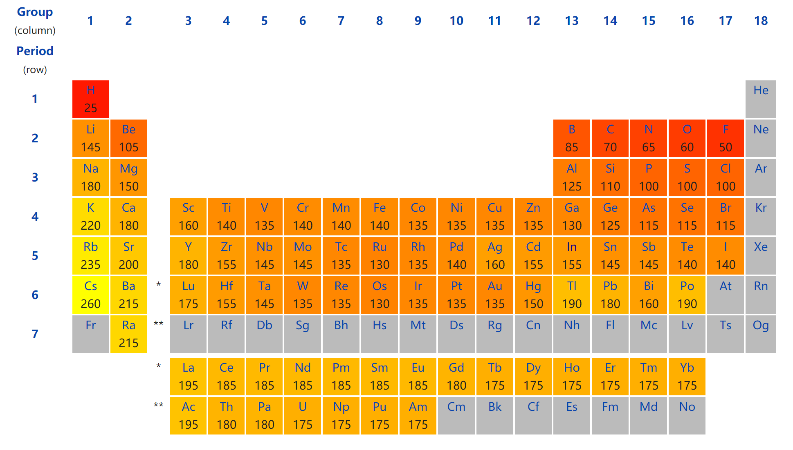

# 吸附能的计算

> Todo

## 影响因素

slab 模型在 Z 方向

- slab 的厚度
- 真空层厚度

一方面影响计算量的大小，另一方面，对于不同的体系，我们需要不同厚度的 slab 模型来保证计算的准确性。例如：对于金属体系来说，越开放的表面往往需要更多的层数。测试或参考他人成果。

slab 模型在 XY 方向

- 表面大小：影响覆盖度，计算的工作量。
- 吸附位点：top(t)，bridge(b)，fcc(f) 和 hcp(h)。
- 吸附物种与表面结合情况：不同的分子构型?用什么原子?哪一部位和表面接触?初始猜测的键长多少? 等等

## 初始构型获取

1. 查数据库

2. 查文献

3. 自己估算：依据原子半径，两原子成键，键长小于两者之和。下图 :)

4. 初算：用一个小模型，简单算一下，得到一个合理的键长。比如 O 吸附在 Cu，直接优化气相中 Cu-O 双原子分子的结构。 [Ex54 简单粗暴地获取初始构型（一） | Learn VASP The Hard Way (bigbrosci.com)](https://www.bigbrosci.com/2018/10/01/ex54/)

> [Empirically measured atomic radius (wikipedia.org)](https://en.wikipedia.org/wiki/Atomic_radius#Empirically_measured_atomic_radius)
