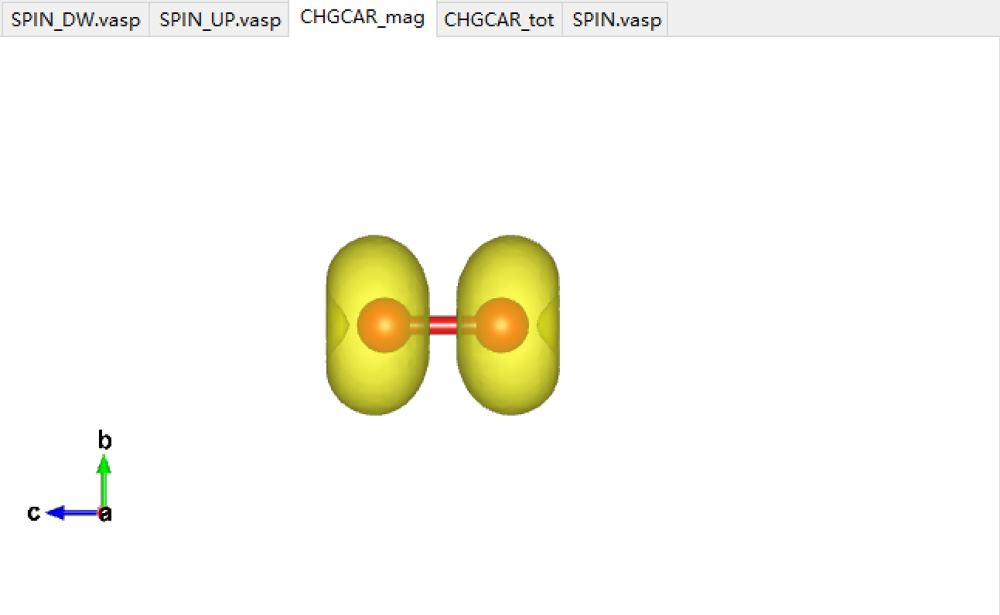
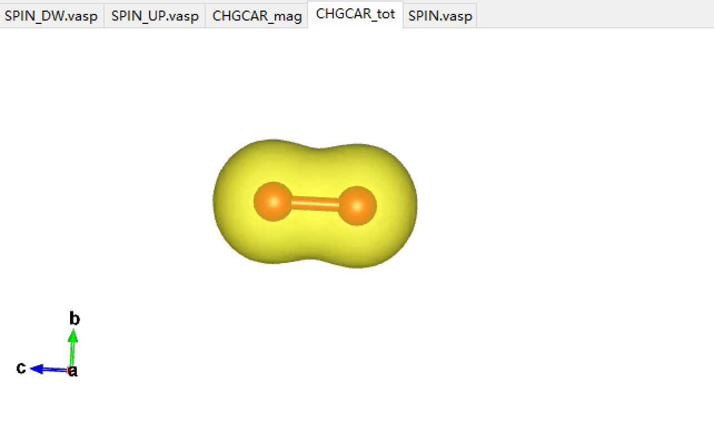
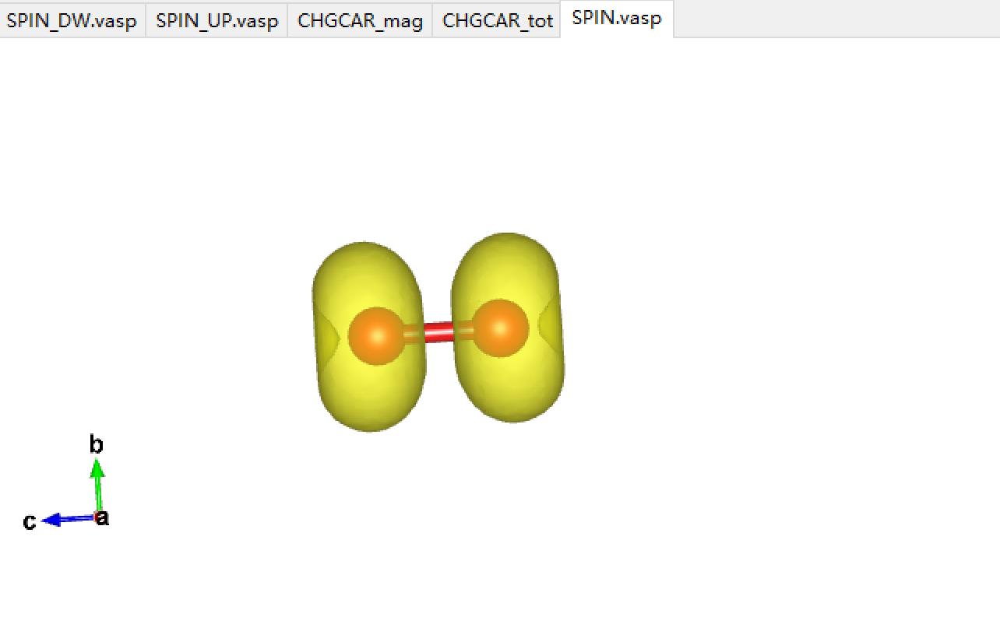

# 自旋电荷密度

本页以 O2 的自选电荷密度为例。

## 步骤

本页操作在完成 [O2 结构优化、自洽、非自洽](..\02.结构优化与静电自洽\02.vasp-opt.md) 中结构优化、静电自洽后进行。[[02.vasp-opt|自洽计算]]

在 `2-scf/` 文件夹中进行。

有两种方法获得其自旋电荷密度：

### 方法 1：通过 VTST 脚本

```bash
# Usage
$ chgsplit.pl <CHGCAR>

# This example
[zjb@op 2-scf]$ chgsplit.pl CHGCAR
Atoms in file: 2
Points in total charge density: 1200000
Points in magnetization density: 1200000
```

得到 `CHGCAR_tot`、`CHGCAR_mag` 两个文件。下载，在 VTSTA 中查看：





### 方法 2：通过 VASPKIT

`vaspkit` — `31) Charge & Spin Density` — `312) Spin Density ` ，生成了 `SPIN.vasp`，下载，在 VESTA 中查看。

```
[zjb@op 5-chg-split]$ vaspkit

 ------------>>
312
  -->> (01) Reading Structural Parameters from CHGCAR File...
  -->> (02) Reading Charge Density From CHGCAR File...
  -->> (03) Reading Spin Density From CHGCAR File...
  -->> (04) Written SPIN.vasp File!
```



## 参考

- [如何画自旋电荷密度图 | 小木虫](http://muchong.com/t-10821450-1)
