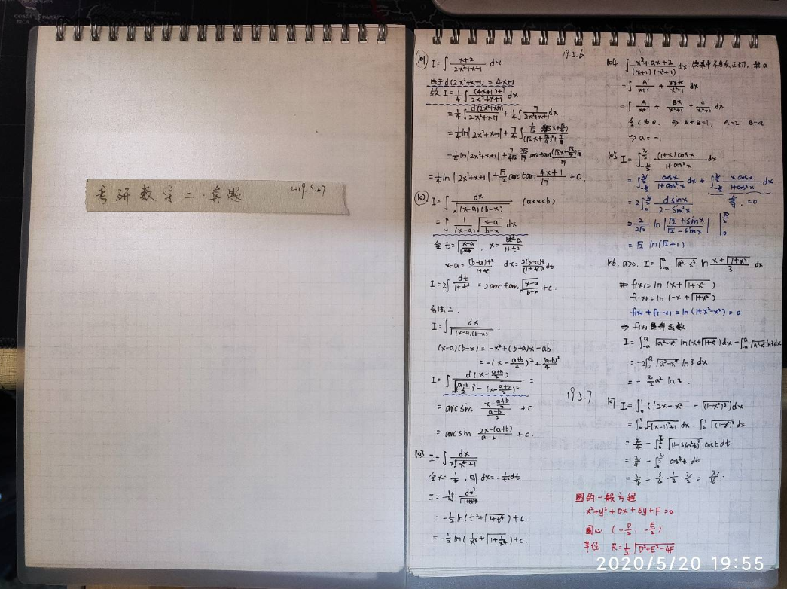

# 考研的一些总结

## 引言

20 考生，101 政治 78，204 英语二 77，302 数学二 89，838 环境学 103，总分 347，初试排名 20+，复试排名 10，总排名 14。

谈一谈这一年踩过的坑与心得。

就按照考试顺序吧。

## 政治

考研政治其实跟好肖秀荣就够了，我先列一下我的：

**基础，6 月—9 月上旬**。主要是明白你都学了些什么鬼东西。听徐涛的视频课，划肖秀荣知识点，做 1000 题。这个工作暑假开始时开始即可，暑假结束前应基本结束（大概）。我是 9 月中下旬结束的视频课和 1000 题第一遍+马原第二遍，属于比较慢的（虽然班里还有些比我还慢的）。

- 肖秀荣知识点精讲精练
- 肖秀荣 1000 题
- 徐涛的强化班视频

**强化，9—11 月中旬。**主要是强化选择题。做 1000 题，至少至少两遍。做的时候记得按照线索归纳总结。这段时间肖秀荣知识点摘要和腿姐的背诵手册应该就发货了，参照着做选择题。如果有余力，背肖秀荣的考点预测。考研政治拉分就在选择上，尤其是多选，腿姐后面有个选择题技巧班，可以听。

> 同时强烈建议能有一个 iPad，那样可以找到 1000 题电子版二刷三刷很方便，不仅是政治 1000 题，很多书都有电子版，那些并不会常看的，直接就在 pad 上浏览了。
>
> 需要的话可以整理一个用乱七八糟的小方法提高效率的文档。

- 腿姐考研政治真题（电子版）
- 肖秀荣知识点摘要和腿姐背诵手册结合看
- 肖秀荣考点预测

**冲刺，11 月中旬—12 月考前一天。**11 月中旬发肖八，12 月中上旬发肖四。分析题把肖四背过，完完全全的背过，就足够了。（年年都有说肖秀荣没压住，今年不压了之类的，年年都是真香），分析题有个 bili UP 叫“空卡空卡空空卡”，会总结一些口诀辅助记忆，可以关注一下。小白考研的东西，怎么说呢，那就是分了下段，我看用的人不少，不过我习惯拿着答案了。还有个研木易木子，比较注重逻辑，就这三个结合着看吧。之后再搞一些其他的卷子做做选择就好。还要注意一点，不要贪多，到那时候肯定是卷子满天飞，谁谁都给你搞模拟题，谁谁都出压题课，技巧班的，记得抓住一个人的背好就够了，千万别被带歪了，重点是要记住，而不是看了课。

注意：肖四肖八上的每一个选择题都要记住，肖四的每个分析题都要背了。

- 肖秀荣八套卷
- 肖秀荣最后四套卷
- 腿姐四套卷
- 腿姐的选择题技巧班

> 这时候你们应该买好了政治资料了，要不然涨价涨的可是快了。当然双十一也可以。
>
> 买的时候找好店铺，尤其是肖四，要不然别人都背了一页了，你的还没发回来。

## 数学

讲道理我数学可不好，我只瞎说。

**课本，1 月—3 月**，基础不好的才有这一步，基础好的直接跳过，时间弹性调整。大三下开学前应该是要把高数上搞完的，下册其实无所谓。代数过不过课本也没啥，有余力看一看还是好的。我当时大三下开学时也并没有过完课本，只把高数上过到了不定积分，然后后面就随意看了看，没有很认真（这样是不对的）。

**基础，3 月—6 月中旬，**这段时间就上基础班呗，然后做做习题集，边看边做题，比如 660、1000、1800，做一本就好。暑假前最好能完整上完基础班，或是跟视频课，或是看全书自学，总之高数+代数基础班知识点要完成。

至于跟那个老师，这玩意看人，张宇、汤家凤、李永乐团队几个老师都听一听，觉得哪个适合自己跟哪个。高数就不说了，我是真没意见。至于代数，就老老实实跟李永乐吧，线代王不是吹出来的。李永乐基础班讲义是《复习全书 基础篇 第二篇》，注意是基础篇，不是数二版，这俩差别还是蛮大的，基础班是给寒假提前开始学数学的人准备的，内容相对少、简单，数二版是给自学的人准备的。没必要买这本书，找找电子版打印一下就好，没几页。强化班用的《线性代数辅导讲义》。个人觉得，基础阶段就把讲义做会，660 上线代做一做，强化阶段讲义上题就不少，做会他，再折回去看看 660。

**强化，6 月中旬—9 月，**这段时间暑假嘛，所谓强化班就把知识点串起来了，习题也更难一些。19 年张宇的体系强化班讲义是闭关修炼，6 月 19 号发到的。也临近期末，就先折腾期末考试吧，但是别折腾几天考试把知识点忘完了就行。

9 月前，结束强化课和习题集。习题集应该两边以上吧，一遍记不住哇。

**真题，9 月中旬—11 月下旬，**看个人情况决定要做几年真题，16、18 好像比较难，甚至空过去都可以，做这两年的着实打击人，当然，数学好的就忽略这句话。按年份按篇章都可以，看人。我是 9.11 开始的第一道真题。真题买张宇真题大全解就好，感觉这本的质量比较高（排版和解析方法）。

**模拟题，11 月下旬—12 月，**要是真题做的慢，这一步都会被直接略掉[/捂脸]，张宇八套卷四套卷难难的，反正我是没做几份模拟题，压根没想拿高分，过线就行— —。李林四套卷是蛮简单的其实，不过冲着押题去找李林还是算辽。

## 英语

首先要评估自己的英语情况，觉得基础不太行，比如会说出“you is a pig”的人，那还是趁早去打基础的好。

把英语分为词汇、长难句、阅读、翻译、作文五个阶段。

**词汇**，某乎和一些考研老师一直宣称要把单词背几遍几遍云云，其实真能背完的还真不多，我就只背了 2k 左右，并且我没有用词汇书，就用墨墨直接背。墨墨会把你不会的单词疯狂出现，一直记不住的甚至一个多月天天出现，想不记住都有些难。背单词这个因人而异，用了墨墨后，我是第一次觉得我真的记住了单词，大概我适合这种方式，所以就一直用下来了。也有人习惯用单词书，一遍一遍快速过。总之尽可能把单词背完，最少最少最少也要把高中频单词记住！开始真题后，真题上的单词必须必须必须记住！

>  有几个墨墨使用上的小提示：
>
>  - 多设备同步学习需要再 A 设备备份后，再在 B 设备还原，才能同步学习记录。
>  - 墨墨收费，但是能确保没天都打卡的话，其实打卡送的额度是够用的。不够就买嘛，50 块 4400 个单词。不太建议用破解版。
>  - 你可以创建自己的词库，这对做真题时很有用，做一份题，把生词加入自己的词库，把这些单词加入学习计划，确保能记住。

**长难句和语法**，基础不好的可以跟新东方田静，讲解很基础了（甚至我觉得有点简单都没看完[/捂脸]），配套书是《句句真研》。基础好的可以直接上阅读。英二甚至可以不学语法，当然最终以自己实际情况决定。

**真题**，首推张剑黄皮书，讲解很细致很全，看了看黄皮书的答案解析，再回去看看四六级（我当时报的考虫）以及以前学英语的答案，简直就是** — —。

**阅读**，可以跟唐迟，但是建议找旧版本视频，比如 18 年的还可以接受。反正我觉得 20 的不好，方法就是那些，变化也不大，最终还是得看自己练习。20 年的直播课经常拖堂，拖堂又不是讲的东西多了，大多是他讲的慢或者讲其他的搞的，一拖半小时的，完了还美名对学生负责，无偿加课时。——喵喵喵？没有能力控制自己的讲解节奏，导致课时安排出错，学生后续计划被推迟，难道不是作为一个老师的失败么？怎么还光荣起来了？？  不过之前的课在新东方录的非直播课还可以。另，不要做模拟题，至少考前一个月内你得用真题适应风格。

**翻译**，新东方唐静。其实我觉得对于英二，这一块没哈必要看哈，有点...简单？英一倒是可以看看，这老师挺实在的。

**新题型**，英二没必要看，过于简单，看的话唐迟有一节课，随意看看就行，英二新题型错一个都是罪过。英一的不太容易，但是我不知道怎么办。

**作文**，我是背作文的支持者。我相信有输入才有输出。王江涛作文那些背一背，他基础阶段给 20 篇，强化阶段给 20 篇，不用全背，他要求背 20 篇，我觉得 10 篇左右就可（主要是我记不住了/哭），重点是要背熟，绝对的熟，能随口说出来组织出来一句话的那种，就像以前背课文第一句话那种的熟练程度。然后默写，很流利不用停笔想还能无错误的那种程度。他有几节课？可以看看，对了解作文结构、改模板还有些帮助。之后再找模板（对的，还是得要模板），不过是自己改模板了，我去年用的见山英二模板，但是几乎完全替换了首段和部分中间段落。（模板考前一个月完成就足够）。考前那段时间会有好多所谓押题预测，完全不需要理会，压住就扯淡，自己在公众号上发个百八十篇的，还只压住了个话题，那 tm 谁不会，我都能自称考研英语名师。

> 有人说背作文没用，说根本写不出来，还不如记模板。——背的作文质量太差，或背的不熟。
>
> 还有说都背王江涛的，全是重复的。——这随意咯，反正背的人看起来不少，这能写出来的却并不多。

**完形填空**，这道题很多人都没时间做的。我推荐新东方易熙人。说实在的，好多老师吹的什么高频词红花词绿叶词虚词高频 balabala 的，基本没用，几十年考研英语他也就能给你挑出来那么几个特例，往那儿一摆，学生一看，“哇！好厉害！”，等他真的自己做的时候就憨了。说到底还是得实打实的搞他。易熙人也搞那一套，不过并不强调，也就随口一提。起码我后期跟的几篇完形填空真题讲解质量还不错。

这些老师大多都有基础课和强化课，其实讲的内容差不了多少，自己感觉一两个视频看需不需要听就好。反正，所有的科目都是：少看视频多做题。

阅读和完形，第一次做大概都会错很多，无所谓，按部就班学就好，千万别慌，一慌就到处换老师[/捂脸]

## 专业课

第一遍不要只看，要背！

第一遍不要只看，要背！

第一遍不要只看，要背！

你会发现不背只看，看一遍再回头看以及全忘完了[/捂脸]

暑假期间应该开始专业课学习。

## 其他

千万别忽视政治和英语，虽然有人说英语决定能不能上，数学决定能上的上限，但是我这次却是政治和英语提了不少分才勉强有机会。

找学校千万别只看最低录取线，至少看到中间去。

确定了目标就努力努力努力，不要害怕，不要放弃，管他能不能考上？学就 vans 了。

整个考研期间，你 可能 会经历数次心态崩溃，我们这一届好几个女生都学着学着就崩溃了，这很正常，调整过来继续学就好，如果，你有崩溃的时候，只需要明白，这是正常现象，坚持学下去就好。我们年级崩溃过好几次的几位，浙大、厦大、中海洋，都录取了。

淘宝有 A4 大小的线环网格笔记本，我 jio 得还挺好用。

草稿纸可以直接淘宝买 A4 纸，十块左右一沓，一年都用不完。

打印大量且不着急可以直接淘宝，便宜得多。

临近考试可以买答题纸模拟，淘宝就有，一般情况下，数学英语各十张足够了。政治和专业课答题纸都是空白的，要是写不齐，可以用打格尺。

做笔记要贴的话纸胶带是个不错的选择。

英语字体可以练练。

学的时候就认真学，一下手机都不要碰！

一定选好学校，有时候，考得好不如选的好。考研是场信息不对称的考试，有时候信息比你的努力更重要。

及时回顾已经学过的，要不然忘完了。

---
