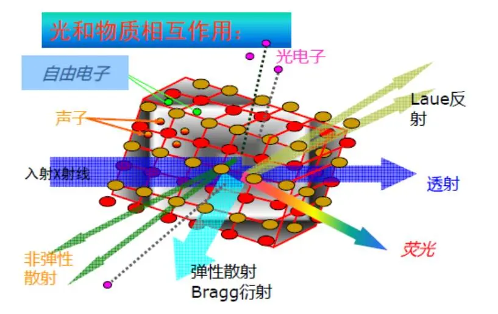

# X 射线吸收谱

download form [精品干货：X射线吸收谱基础知识（一） - 哔哩哔哩 (bilibili.com)](https://www.bilibili.com/read/cv6701754)

撰文：LY & CWX   编辑：DJ

**前言：**

随着同步辐射光源的建造，X 射线吸收谱学方法（XAS）得到了前所未有的发展，在物质结构表征（包括原子结构及电子结构等）、理化性能解释（比如单原子催化剂位点研究、In-situ/operando 测试等）都发挥着越来越重要的作用，前沿研究中都经常看见其身影。一直以来，可以说 XAFS 都是基于同步辐射的各种表征手段中同步辐射技术中应用范围最广泛广的技术之一。

目前，在大陆布局的同步辐射光源装置主要有 **北京同步辐射装置**（BSRF，第一代光源）、中国科学技术大学里的 **合肥国家同步辐射国家实验室**（NSRL，第二代光源）、以及 **上海光源**（SSRF，第三代光源），对国内众多基础科学的研究发挥了重要支撑作用。

而上海光源二期工程的开展，规划中的北京先进光源（高能光源）以及各能量段的自由电子激光（FEL）装置（包括极紫外区 - 大连、软 X 射线区 - 上海、硬 X- 射线区 - 地点待定，FEL 被认为是第四代光源）的建设极有可能在未来数年内建成也必将极大的推动国内 X 射线吸收谱的发展掀起新一轮 XAS 应用高潮，为前沿基础科学、高技术研究提供不可或缺的手段。（高能同步辐射光源、硬 X 射线自由电子激光装置已列入 2017 年发布的《国家重大科技基础设施建设“十三五”规划》，属于优先布局的十个重大科技基础设施建设项目。）

图 1. 同步辐射装置的发展（图片来源：Science, 2011, 334, 1234-1239.）

一直以来，XAFS 都是基于同步辐射的各种表征手段中应用范围最广泛的技术之一。小编将分几期内容来跟大家简单介绍一些 XAS 以及同步辐射的基本知识，希望对大家看文献与做研究有所帮助。今天是第一期，我们先给大家一个初步的吸收谱的印象。

**A.**  **什么是****X 射线？**

图 2.波长与能量的关系

X 射线又称伦琴射线，是一种波长介于紫外线与γ射线之间的电磁波，波长约为 0.01~10nm，其能量范围为 100 eV-100 keV。X 射线根据其能量高低可以分为 **硬****X 射线和软 X 射线**。能量为 1-10 keV，波长为 0.2-0.1 nm 以下的称之为硬 X 射线，波长大于 0.1 nm 则称之为软 X 射线（X- 射线的软硬之分并没有严格界限）。

**硬****X 射线**能量高，穿透能力强，波长与原子半径相当，基于硬 X 射线的表征方法（如衍射、散射、吸收等）已被广泛应用于物质原子结构分析中。而软 X 射线，能量较低，对样品辐射损伤相对较小（**但容易被空气或水吸收而发生衰减**），在电子结构分析、物质成像研究中发挥着重要作用。

图 3.X- 射线和物质的相互作用（图片来源：BSRF 的 XAS 讲习班）

 **B.**    **什么是****X 射线吸收光谱（XAS）？什么是吸收边？**

当 X 射线穿过样品时，由于样品对 X 射线的吸收，光的强度会发生衰减，这种衰减与样品的组成及结构密切相关。**X 射线吸收光谱就是利用 X 射线入射前后信号变化来分析材料元素组成，电子态及微观结构等信息的光谱学手段。XAS 方法通常具有元素分辨性，几乎对所有原子都具有相应性，对固体（晶体或非晶）、液体、气体等各类样品都可以进行相关测试**。

以透射模式为例，大家可以简单类比成我们熟悉的紫外可见吸收光谱。

图 4. 物质对 X 射线的吸收

入射光 I 与出射光 I0 的强度遵从朗伯比尔定律：

而 **吸收系数μ** 表征 X 射线被样品吸收的概率，μ与样品的密度（ρ），元素的原子序数（Z）有关，而 t 为样品厚度。而最为重要的是，μ对 X 射线能量（E）也是敏感的：

**思考：为什么 XAS 要采用同步辐射光源？** **什么是吸收边？**

当 X 射线能量等于被照射样品某内层电子的电离能时，会发生共振吸收，使电子电离为光电子，而 X 射线吸收系数发生突变，这种突跃称之为吸收边（Edge）。原子中不同主量子数的电子的吸收边相距颇远，按主量子数命名为 K、L……吸收边等。注意：每一种元素都有其特征的吸收边系，因此 XAS 可以用于元素的定性分析。此外，吸收边的位置与元素的价态相关，氧化价增加，吸收边会向高能侧移动（一般化学价 +1，吸收边移动 2-3 eV），因此同种元素，化合价不同也识可以分辨出来。

图 5.能级与吸收边

普通化学知识补充：原子外层电子根据排布轨道的不同，不同主量子数对应的轨道依为：主量子数（n）1 2 3 4 5 6 7 电子层符号   K L M N O P Q

**C.**    **什么是****X 射线吸收精细结构（X-ray Absorption Fine Structure）？**

人们发现，X 射线吸收光谱在吸收边附近及其高能量端存在一些分立的峰或波状起伏，称为精细结构。如下图所示：

图 6.XANES 和 EXAFS 的划分

精细结构从吸收边前至高能延伸段约 1000eV, 根据其形成机制（多重散射与单次散射）的不同，可以分为 **XANES 和 EXAFS**（两者并无严格界限）：

- XANES (**X 射线吸收近边结构**，X-ray Absorption Near Edge Structure)，对于软线 XAS 谱而言通常也被称作 NEXAFS(Near-Edge X-ray Absorption Fine Structure)
  - **范围**：吸收边前 - 吸收边后 50eV,
  - **特点：** 振荡剧烈（吸收信号清晰，易于测量）；谱采集时间短，适合于时间分辨实验；对价态、未占据电子态和电荷转移等化学信息敏感；对温度依懒性很弱，可用于高温原位化学实验；具有简单的“指纹效应”，可快速鉴别元素的化学种类。

- EXAFS (**扩展 X 射线吸收精细结构谱**, Extend X-ray Absorption Fine Structure )
  - **范围**：吸收边后 50eV - 1000eV，
  - **特点：** 可以得到中心原子与配位原子的键长、配位数、无序度等信息。不过，EXAFS 对立体结构并不敏感。
