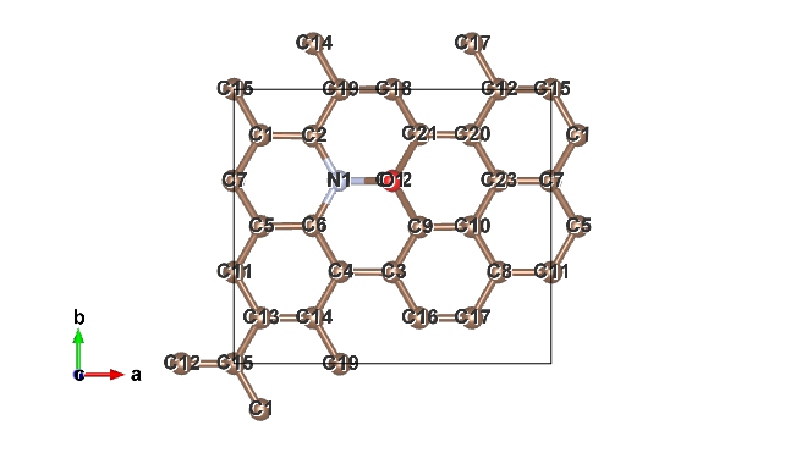
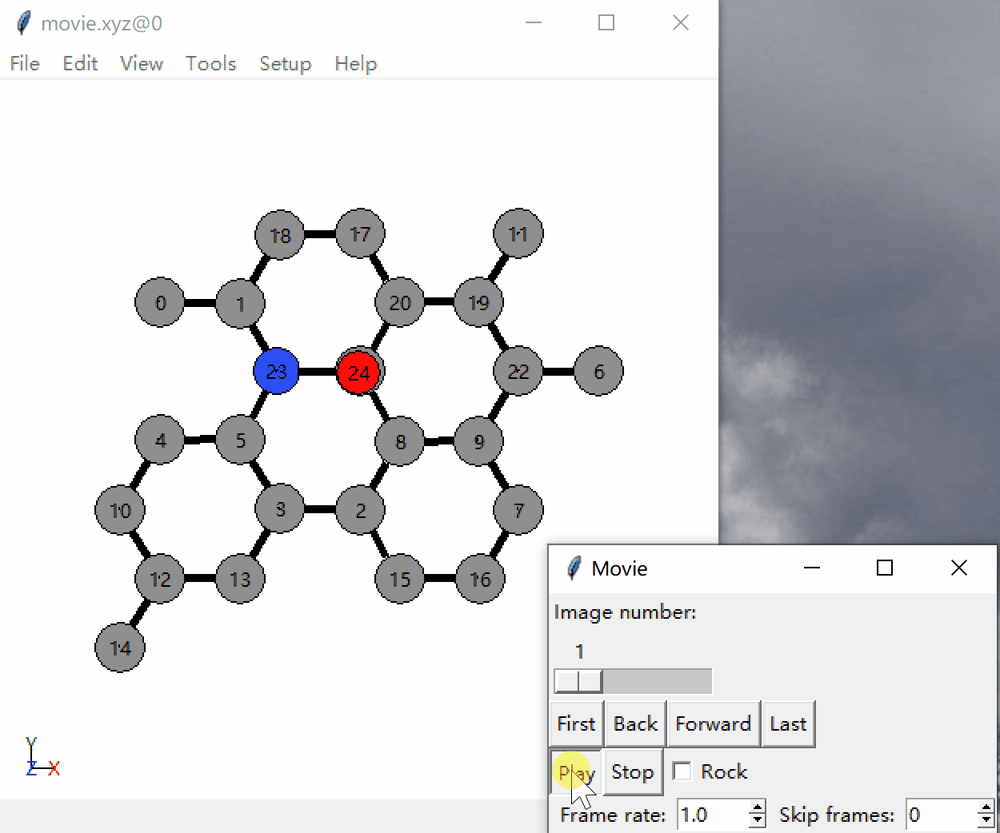
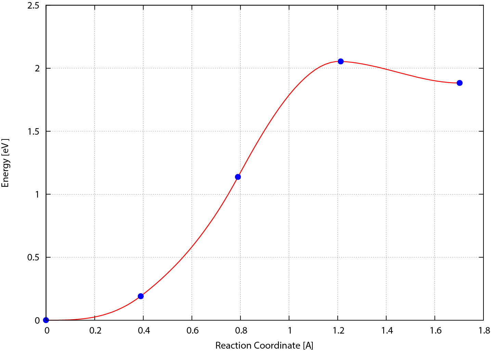

# 使用 NEB 方法计算反应路径

## 流程

1. 分别对初态和末态进行结构优化
2. 使用脚本生成中间过程图像 (结构)
3. NEB 计算
4. 处理结果

## 文件结构

::: details


> 这张图整挺好，直接拿过来了，[这是原地址](cndaqiang.github.io/2018/12/07/NEB/)。

```
[zjb@op neb]$ tree
.
├── ini                ***初态常规结构优化***
│   ├── CONTCAR            -初态优化后的结构——新的初态
│   ├── INCAR              -初态结构优化的输入文件1
│   ├── ini2.vasp          -
│   ├── KPOINTS            -初态结构优化的输入文件2
│   ├── OSZICAR
│   ├── OUTCAR
│   ├── out.log
│   ├── POSCAR             -初态结构优化的输入文件3
│   ├── POTCAR             -初态结构优化的输入文件4
│   ├── stdout
│   ├── vasp.pbs
├── fin                ***末态常规结构优化***
│   ├── CONTCAR            -末态优化后的结构——新的末态
│   ├── fin2.vasp
│   ├── INCAR
│   ├── KPOINTS
│   ├── OSZICAR
│   ├── OUTCAR
│   ├── out.log
│   ├── POSCAR
│   ├── POTCAR
│   ├── stdout
│   └── vasp.pbs
├── 00                 ***↓↓↓*****中间态*****↓↓↓***
│   ├── OUTCAR            -初态结构优化后的OUTCAR   ../ini/OUTCAR
│   ├── POSCAR            -初态结构优化后的CONTCAR  ../ini/CONTCAR
│   └── POSCAR.xyz
├── 01
│   ├── CONTCAR
│   ├── OUTCAR
│   ├── POSCAR
│   └── POSCAR.xyz
│   └── stdout
├── 02
│   ├── CONTCAR
│   ├── OUTCAR
│   ├── POSCAR
│   ├── POSCAR.xyz
│   └── stdout
├── 03
│   ├── CONTCAR
│   ├── OUTCAR
│   ├── POSCAR
│   ├── POSCAR.xyz
│   └── stdout
├── 04
│   ├── OUTCAR            *末态结构优化后的OUTCAR  ../fin/OUTCAR
│   ├── POSCAR            *末态结构优化后的CONTCAR ../fin/CONTCAR
│   └── POSCAR.xyz     ***↑↑↑*****中间态*****↑↑↑***

├── INCAR              ***neb计算的输入文件等***
├── KPOINTS
├── movie
├── movie.xyz
├── neb.dat
├── out.log
├── POTCAR
├── stdout
├── vasp.pbs
└── vasprun.xml
```

:::

## 步骤

### Step1. 分别对初态和末态进行常规的结构优化

上课时的例子是 `O 在 N 掺杂的石墨烯上的吸附`，其中 `INCAR` 为

::: details

```
Global Parameters
ISTART =  0            (Read existing wavefunction; if there)
LREAL  = .FALSE.          (Projection operators: automatic)
ENCUT  =  400        (Cut-off energy for plane wave basis set, in eV)
PREC   =  Normal       (Precision level)
LWAVE  = .FALSE.        (Write WAVECAR or not)
LCHARG = .FALSE.        (Write CHGCAR or not)
ALGO = Fast

Electronic Relaxation
ISMEAR =  0            (Gaussian smearing; metals:1)
SIGMA  =  0.1         (Smearing value in eV; metals:0.2)
NELM   =  60           (Max electronic SCF steps)
NELMIN =  4            (Min electronic SCF steps)
EDIFF  =  1E-04        (SCF energy convergence; in eV)

Ionic Relaxation
NSW    =  100          (Max electronic SCF steps)
IBRION =  2            (Algorithm: 0-MD; 1-Quasi-New; 2-CG)
ISIF   =  0          (Stress/relaxation: 2-Ions, 3-Shape/Ions/V, 4-Shape/Ions)
EDIFFG = -1E-01        (Ionic convergence; eV/AA)
POTIM = 0.3
```

:::

> [!warning]
> 两个 `POSCAR` 中，**元素顺序必须对应**，要不然后面测相似度会出问题，会变得很大。（通过 cif2pos 和 xsd2pos 的默认排的顺序不一样哦，已踩坑）



上图：初态结构优化后的

下图：末态结构优化后的


初末态看起来不一样是因为周期性导致的，只是显示的不同而已。

### Step2. 使用脚本处理中间过程

结构优化后，原初末态的 `CONTCAR` 就成为了新的初态和末态

#### 对初末态测相似度以确定插点数量

```bash
# Usage
$ dist.pl <初态结构> <末态结构>

# This example
[zjb@op 3-NEB_O_graphene]$ dist.pl ini/CONTCAR fin/CONTCAR 
1.55500097020471
```

> [!tip]
> 若返回值<5，通常可以下一步
>
> 插点数量通常是 `相似度/0.8`.

#### 插入中间图像

`nebmake.pl` 以线性进行插点。

```bash
# Usage
$ nebmake.pl <初态结构> <末态结构> <插点数量>

# This example
[zjb@op 3-NEB_O_graphene]$ nebmake.pl ini/CONTCAR fin/CONTCAR 3   # 3为插点数量，咱这儿把它记为N
filetype1: vasp5
filetype2: vasp5

OK, ALL SETUP HERE
FOR LATER ANALYSIS, PUT OUTCARs IN FOLDERS 00 and 04 !!!
```

> [!warning]
> 提交任务时，CPU 需要是插点数量 N 的整数倍

这一步执行后，会生成 N+1 个文件夹，其中 00 是初态，N+1 是末态。同时会把 `ini/CONTCAR` 复制到 `00/POSCAR`，把 `fin/CONTCAR` 复制到 `N+1/POSCAR`。

根据这一步返回的提示，分别将初末态的 `OUTCAR` 复制到 `00` 和 `N+1` 文件夹，以便于后续分析。

```bash
cp ini/OUTCAR 00/
cp fin/OUTCAR 04/
```

#### 使用 nebmovie 查看生成的路线是否合理

```bash
nebmovie.pl
```

执行后会生成 `movie.xyz` 文件，`ase-gui 文件路径` 查看。



### Step3. NEB 计算

#### 准备 NEB 计算的输入文件

`POTCAR` 和 `KPOINTS` 不用改直接复制过来就好，不用准备 POSCAR，他已经在上一步被放进 `00/` 和 `04/` 中了,

`INCAR` 要修改不少东西：

```
Global Parameters
 NPAR   =  6           插点个数N的整数倍
 
Electronic Relaxation
 EDIFF  =  1E-05
  
Ionic Relaxation
 NSW    =  100         (Max ionic steps)
 IBRION =  3           (Algorithm: 0-MD; 1-Quasi-New; 2-CG)
 POTIM  =  0            IBRION = 3, POTIM = 0，是VTST识别并启动VTST优化算法的标致
 ISIF   =  0           (Stress/relaxation: 2-Ions, 3-Shape/Ions/V, 4-Shape/Ions)
 EDIFFG =  -0.2        (Ionic convergence; eV/AA)

NEB
 LCLIMB   =  .FALSE.     爬坡（CI-NEB），由于要用neb而不是cineb，所以关闭。
 ICHAIN   =  0           开启NEB方法
 IMAGES   =  3           插点个数
 IOPT     =  7           VTST的优化算法。1-2适合精收敛，7适合粗收敛
 MAXMOVE  =  0.1
 TIMESTEP =  0.05 
```

> [!note]
> 发现 MAXMOVE=0.2，TIMESTEP=0.1，EDIFF=1E-04，收敛的更快一些。精度的问题罢辽，可以分两次进行，先粗后细呢。

详见 [Nudged Elastic Band Options | VTST Tools](#nudged-elastic-band-options) 和 [Optimizer input parameters(IOPT) | VTST Tools](http://theory.cm.utexas.edu/vtsttools/optimizers.html)。

#### 提交计算

修改 PBS 脚本文件的核数。数量是插点数量 N 的整数倍。（第 4 行）

注意 walltime，适当长一些。（第 5 行）

修改 PBS 脚本，使其调用 VTST 编译的 VASP 进行计算（第 13，27 行）

> [!warning]
> 需要注意 VTST 编译的时候是使用哪种 mpi（intel mpi OR open mpi）进行并行运行的，如下高亮行 12-13。如果 mpi 选择有误，会出现只算一个点，而其他点不动的情况（反映在 stdout 里是用 6 个核分别把第一个点算了 1 遍，等于把第一个点算了 6 遍），这个问题直到我尝试自己编译 vasp 的时候才发现原因。

```bash {13,27}
[zjb@op test-vtst-neb]$ cat vasp-vtst.pbs 
#!/bin/sh
#PBS -N Untitled
#PBS -l nodes=1:ppn=6
#PBS -l walltime=05:30:00
#PBS -j oe
#PBS -o ./out.log
#PBS -q energy

cd ${PBS_O_WORKDIR}
source /public/software/profile.d/compiler_intel-composer_xe_2015.2.164.sh
# source /public/software/profile.d/mpi_intelmpi-5.0.2.044.sh
source /public/software/profile.d/mpi_openmpi-2.0.0-intel.sh
echo "============================================="
echo "Starting VASP at" `date` 
echo "---------------------------------------------"
echo "VTST VASP"
echo "The PBS_O_WORKDIR is" $PBS_O_WORKDIR
echo "The PBS_JOBID     is" $PBS_JOBID
echo "The PBS_JOBNAME   is" $PBS_JOBNAME
echo "The PBS_O_QUEUE   is" $PBS_O_QUEUE
echo "The PBS_O_HOST    is" $PBS_O_HOST
NP=`cat $PBS_NODEFILE | wc -l`
echo "The num of PBS_NODEFILE is" $NP
echo "The PBS_NODEFILE IS:" 
cat $PBS_NODEFILE
mpirun -np $NP -machinefile $PBS_NODEFILE /public/software/apps/vasp/5.4.1/vtst-ompi/vasp_std >& stdout
echo "---------------------------------------------"
echo "End task at " `date` 
echo "============================================="
```

脚本因机器实际环境不同而需要更改，但大同小异。

如何确定调用的是 VTST&VASP？

在 `01~N+1/` 下，`grep VTST OUTCAR` 应有 VTST 版本号返回。

> [!note] NOTE: NEB 接着算
> 如果算了一半被 kill 了，要接着算，只需要把 00、01、02 下的 `CONTCAR` 覆盖 `POSCAR`，然后再次提交就可。

#### 检查是否收敛

```bash
# Usage
$ nebef.pl

# This example
[zjb@op test-vtst-neb]$ nebef.pl 
   0         0.000000      -224.399900         0.000000 
   1         0.148350      -224.208300         0.191600 
   2         0.132181      -223.262900         1.137000 
   3         0.096709      -222.345700         2.054200 
   4         0.000000      -222.517000         1.882900 
```

返回结果为 ` 序号 `—` 最大原子受力 `—` 能量 `—` 相对初态的能量 `.

当所有插点的最大原子受力都 < |EDIFFG| 时，计算收敛。

> [!tip]
> 如果发现这一步受力那一列全是 0，可以考虑检查一下是否调用了 VTST 编译的 VASP 进行计算。

#### 检查切向力

```bash
# Usage
$ nebbarrier.pl && cat neb.dat

# This example
[zjb@op test-vtst-neb]$ nebbarrier.pl && cat neb.dat
  0     0.000000     0.000000     0.000000   0
  1     0.389947     0.191613    -1.474390   1
  2     0.789822     1.137031    -3.591041   2
  3     1.212818     2.054245     0.086021   3
  4     1.701348     1.882893     0.000000   4
```

返回结果为 ` 序号 `——` 距离 `——` 能量 `——` 切向力 `。

- 该命令没有输出到屏幕的内容，而是生成 neb.dat 文件。
- 第二列表示距离 (即临近两结构的 dist.pl 的计算结果)，
- 第三列表示能量 (以初态能量为参考值)，
- 第四列为切向力 (forces along the neb)
  过渡态附近切向力会正负变号，而且接近 0。（例如 3）

#### ~~频率计算~~

Todo...

#### 打包结果

```bash
# Usage
$ nebresult.pl

# This example
[zjb@op test-vtst-neb]$ nebresults.pl 

Unziping the OUTCARs ... done
Do nebbarrier.pl ; nebspline.pl
Do nebef.pl
Do nebmovie.pl
Do nebjmovie.pl
Do nebconverge.pl

Forces and Energy:
   0         0.000000      -224.399900         0.000000 
   1         0.148350      -224.208300         0.191600 
   2         0.132181      -223.262900         1.137000 
   3         0.096709      -222.345700         2.054200 
   4         0.000000      -222.517000         1.882900 

Extremum 1 found at image  0.000000 with energy:  0.000000
Extremum 2 found at image  0.000330 with energy: -0.000000
Extremum 3 found at image  2.985984 with energy:  2.054500
```

从输出和源码可以了解到，`nebresult.pl` 做的事情如下：

0. ~~解压缩 OUTCAR.tg~~
1. 执行 `nebbarrier.pl`，该脚本生成 `neb.dat`，将收敛情况，NEB 方向力，能量，写入
2. 执行 `nebspline.pl`，该脚本对 `neb.dat` 里 能量和距离 的关系进行插值，插值结果写入 `spline.dat` 文件，所有极值的位置和能量写入 `exts.dat`，把 MEP 画成 `mep.eps`。
    `mep.eps` 是以 `dist.pl` 距离为横坐标，能量为纵坐标画出的能势垒图，可用矢量图编辑软件打开，我们也可以使用 `neb.dat` 的数据用 Origin 画图。

3. 执行 `nebef.pl`，并将其结果（力和能量）写入 `nebef.dat`。
4. 执行 `nebmovie.pl`，该脚本生成结构变化
5. 执行 `nebjmovie.pl`，
6. 执行 `nebconverge.pl`
7. ~~还有对各文件夹中的 OUTCAR 打包压缩。~~ 我在源码里注释掉了这一部分。
8. 屏显 `nebef.dat` 和 `exts.dat`。

    生成的 vaspgr 文件夹内是各个插点结构的收敛图。

具体见 [Nudged Elastic Band Scripts | VTST Tools](#nudged-elastic-band-scripts)

其中 mep.eps 就是这样子：



## 其他

### [Nudged Elastic Band] Scripts

 [Nudged Elastic Band Scripts | VTST Tools](http://theory.cm.utexas.edu/vtsttools/scripts.html#nudged-elastic-band-scripts)

### [Nudged Elastic Band] Options

 [Nudged Elastic Band Options | VTST Tools](http://theory.cm.utexas.edu/vtsttools/neb.html#nudged-elastic-band-options)

| Variable    | Default Value      | Type    | Description                                                  |
| :---------- | :----------------- | :------ | :----------------------------------------------------------- |
| ICHAIN      | 0 \| int           |         | Indicates which method to run. NEB (ICHAIN=0) is the default |
| IMAGES      | none               | int     | Number of NEB images between the fixed endpoints             |
| SPRING      | -5.0               | float   | The spring constant, in eV/Ang^2 between the images; negative value turns on nudging |
| LCLIMB      | .TRUE.             | boolean | Flag to turn on the climbing image algorithm                 |
| LTANGENTOLD | .FALSE.            | boolean | Flag to turn on the old central difference tangent           |
| LDNEB       | .FALSE.            | boolean | Flag to turn on modified double nudging                      |
| LNEBCELL    | .FALSE.            | boolean | Flag to turn on SS-NEB. Used with ISIF=3 and IOPT=3.         |
| JACOBIAN    | (Ω/N)^{1/3}N^{1/2} | real    | Controls weight of lattice to atomic motion. Ω is volume and N is the number of atoms. |

## 参考资料

- [vasp+VTST 进行 NEB 过渡态计算 | cndaqiang](https://cndaqiang.github.io/2018/12/07/NEB/)
- [vasp-vtst 计算过渡态--NEB 方法 | 刘锦程](http://blog.wangruixing.cn/2019/08/19/cineb/)
- [Nudged Elastic Band Scripts | VTST Tools](http://theory.cm.utexas.edu/vtsttools/scripts.html#nudged-elastic-band-scripts)
- [Nudged Elastic Band Options | VTST Tools](http://theory.cm.utexas.edu/vtsttools/neb.html#nudged-elastic-band-options)
- [FORCE BASED OPTIMIZERS (IOPT) | VTST Tools](http://theory.cm.utexas.edu/vtsttools/optimizers.html)
