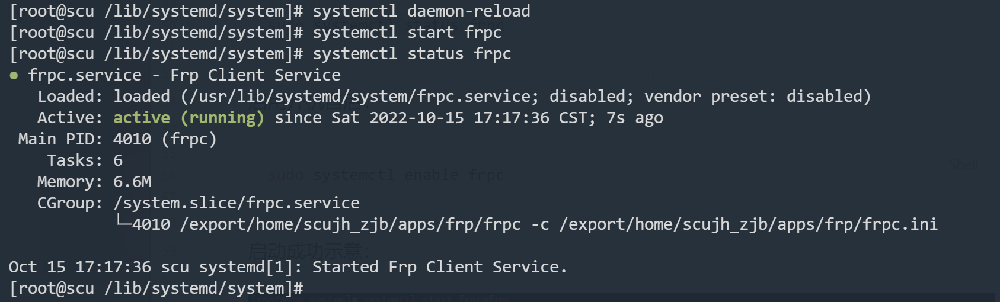
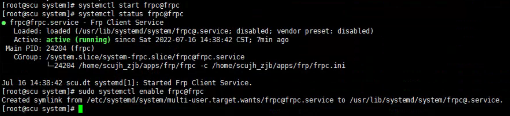

# 内网穿透折腾记录

## 通过 frp

### 配置参考

### linux 端 systemctl 配置

frp 包中提供了 systemctl 的配置文件模板，服务端和客户端各两个，带 `@` 的可以传参以启动多个实例。将模板复制到 systemctl 服务配置路径：`/lib/systemd/system/`。

```bash
[Unit]
Description=Frp Client Service
After=network.target

[Service]
Type=simple
Restart=on-failure
RestartSec=5s
ExecStart=/home/scujh_zjb/apps/frp/frpc -c /home/scujh_zjb/apps/frp/frpc.ini
ExecReload=/home/scujh_zjb/apps/frp/frpc reload -c /home/scujh_zjb/apps/frp/frpc.ini
LimitNOFILE=1048576

[Install]
WantedBy=multi-user.target
```

初次配置后需要重载服务，之后启动无须此步：

```bash
systemctl daemon-reload
```

然后启动服务：：

```bash
#启动 
sudo systemctl start frpc 
#关闭 
sudo systemctl stop frpc 
#重启 
sudo systemctl restart frpc 
#查看状态 
sudo systemctl status frpc
```

启用开机自启：

```bash
sudo systemctl enable frpc
```

启动成功示意：




